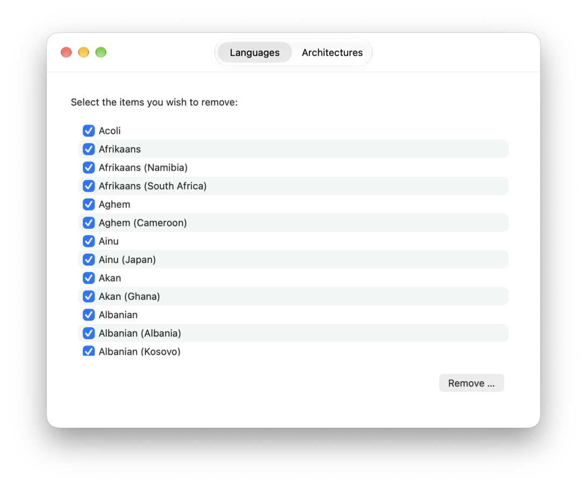

Monolingual
===========

#### A tool for removing unneeded language localization files for macOS

## Screenshot

## What's new in 2.0.1

A patch release for 2.0.

- **Thinning a very large universal binary no longer crashes.** The architecture offsets of a fat
  file are added in 64 bits, and a file whose slices would not fit a 32-bit header is refused
  instead of trapping.
- **The disk image installs without a network.** The app inside it had no notarization ticket
  stapled to it — only the zip did — so Gatekeeper had to ask Apple about the app before it would
  run, which fails on a Mac that is offline or behind a restrictive network. The app is now stapled
  before the disk image is built.

## What's new in 2.0

2.0 is the first release since 1.8.2 and requires macOS 27 on an Apple silicon Mac.

- **A new interface.** Monolingual is rewritten in Swift 6 with a SwiftUI interface. The English
  language files can no longer be selected for removal — deleting them breaks a macOS installation
  beyond repair.
- **Removals you can watch, and stop.** A removal reports what it is doing in a sheet, showing the
  file it is working on and the space freed so far, and can be cancelled. A notification tells you
  when it is done, with the space it saved.
- **A different helper.** The privileged helper is registered with Service Management
  (`SMAppService`) instead of the deprecated `SMJobBless`; approve it once under System Settings ›
  General › Login Items & Extensions. It verifies that the processes talking to it are Monolingual,
  and it no longer follows symbolic links.
- **Updates you can trust.** Monolingual uses Sparkle 2 with EdDSA-signed updates, and the app is
  notarized.
- **Better translations.** Turkish is new since 1.8.2, and all 16 translations are complete, kept in
  a String Catalog so that no string can go stale.
- **Fixed.** A blocklist download that failed used to leave the blocklist empty, which crashed the
  next removal.

## Architecture

Monolingual consists of two parts: the sandboxed Monolingual app and a privileged helper program that
is registered as a launch daemon with Service Management (`SMAppService`). Both are written in Swift and
communicate with each other using XPC.

An administrator has to allow the helper in System Settings › General › Login Items & Extensions
before it can run.

## Dependencies

Monolingual uses Swift Package Manager to manage its dependencies. Currently, the following packages
are used:

- [Sparkle](https://github.com/sparkle-project/Sparkle) — app updates
- [swift-argument-parser](https://github.com/apple/swift-argument-parser) — argument parsing for the
  bundled `lipo` tool

## Building

- Build (Debug): `make development`
- Build (Release): `make deployment`
- Release packaging (signing, notarization, disk image): `make release`
- Run the tests: `swift test` (or `xcodebuild -scheme Helper -destination 'platform=macOS' test`)

The project uses [SwiftLint](https://github.com/realm/SwiftLint) and
[SwiftFormat](https://github.com/nicklockwood/SwiftFormat); their configurations are checked in as
`.swiftlint.yml` and `.swiftformat`.

## Contributors

### Main developer
Ingmar J. Stein

### Original idea
J. Schrier

### Localization

- Croatian localization by Alen Bajo
- Dutch localization by Tobias T.
- French localization by François Besoli
- German localization by Alex Thurley
- Greek localization by Ευριπίδης Αργυρόπουλος
- Italian localization by Claudio Procida
- Japanese localization by Takehiko Hatatani
- Korean localization by Woosuk Park
- Polish localization by Mariusz Ostrowski
- Romanian localization by Eugen Mihalache
- Slovak localization by Richard Gráčik
- Spanish localization by Fran Ramírez
- Swedish localization by Joel Arvidsson
- Turkish localization by Hasan Beder

### Artwork
Icon by Matt Davey

## License

GNU GENERAL PUBLIC LICENSE, Version 3, 29 June 2007

## Developers

Monolingual is written in Swift 6 and requires macOS 27 on Apple silicon, with Xcode 27.0 or above to
build it. The privileged helper targets macOS 26.

## Status

